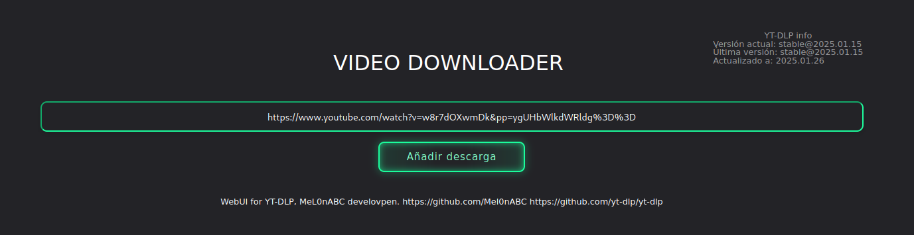
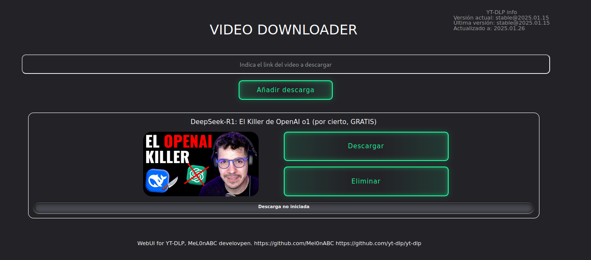
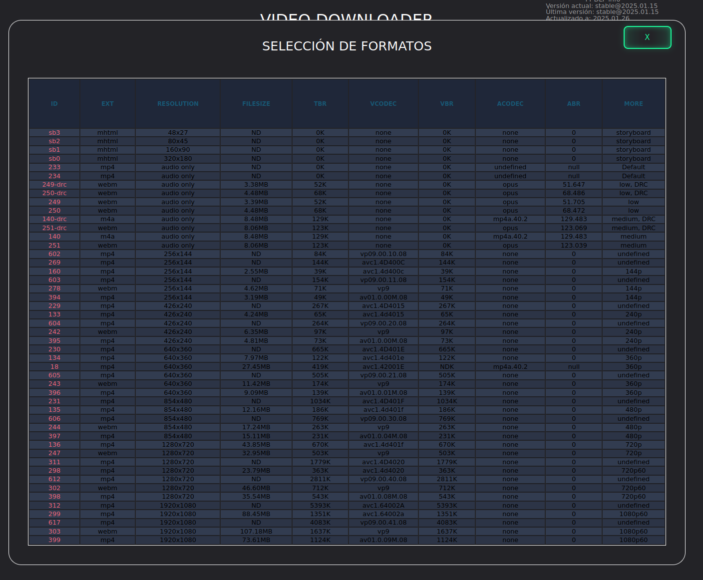
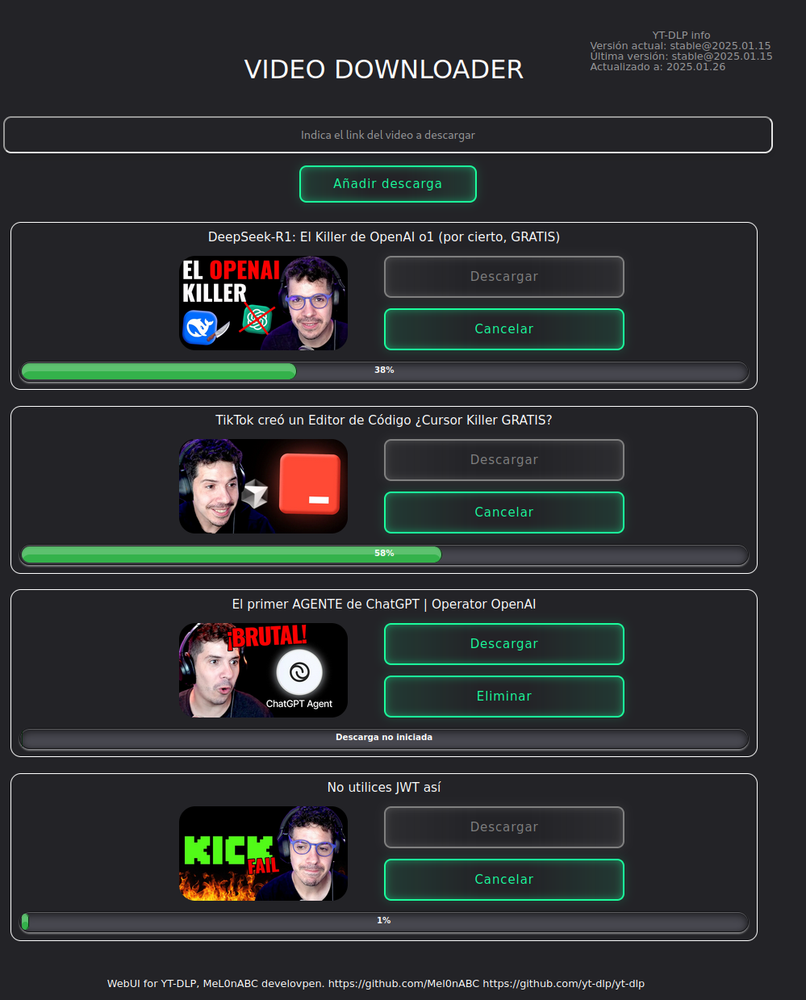
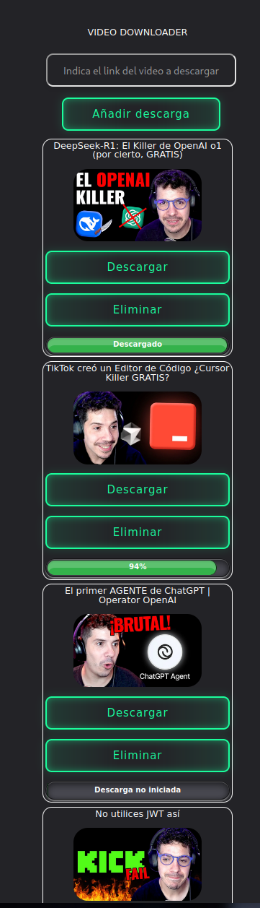

User interface for yt-dlt. 

For all skills, go to https://github.com/yt-dlp/yt-dlp

Insert video URL:

Then press download boton:

Select clicking in format type to download:

Control your download with the progress bar:

Multiple downloads:

Tablets, movils, etc:

Installatión:

DEPENDENCYS:

- maven
- openjdk23

How to:

- Download de files, use git or link to zip file.
- Unzip or enter in folder.
- Execute command -> mvn spring-boot:run

Other posibilities:

Docker -> https://hub.docker.com/repository/docker/mel0nabc/videodownloader/general